# Roller Coaspline - **Unity/C#**
### ISART DIGITAL GP3, School Project: *Rémi GINER*

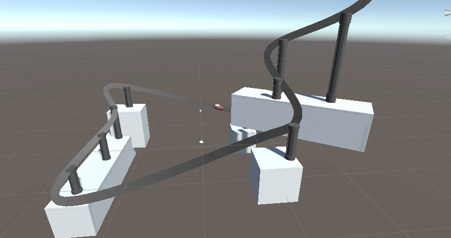

<!-- ABOUT THE PROJECT -->
# About The Project 

The goal of this project is to develop a tool to create, edit and use Splines curves. This tool must then be used to apply curves in a "Video Game" context of our choice. I made the choice to develop a procedural generator of roller coaster track.

# Table of contents
1. [Features](#features)
2. [Controls](#controls)
3. [Details](#details)
    - [Technical Implementation](#technical-implementation)
    - [Gameplay Implementation](#gameplay-implementation)
4. [In the future](#itf)
5. [References](#references)
6. [Versionning](#versionning)
7. [Autors](#authors)

# Features
- Hermite Spline, Bezier Spline, B-Spline, Catmull-Rom Spline
- Point insertion
- Position evalution from polynomial and matrix
- Tangent evalution from polynomial and matrix
- Rail procedural generation from spline

# Controls
There is no character controller, to navigate in the scene you have to use the scene viewer no clip mode.
- To change the current scene you have to use the Unity Content Browser.
- To move a point you have to select the Spline and drag one of the point.
- To insert a new point you have to select the Spline drag one of the point, and press Ctrl at the same time.

# Details
## Technical Implementation

### **Spline Controller**

To have a proper control on the Spline, I had to create a Controller that gathers information on the points collects to be able to evaluate the requested information according to the input formula.

The Spline Controller also allows to give a spatial representation to the Spline to be calculated. When the checkbox "isTransformBounded" is checked, the Spline is calculated in the local frame of the GameObject, otherwise it is calculated in WorldSpace.

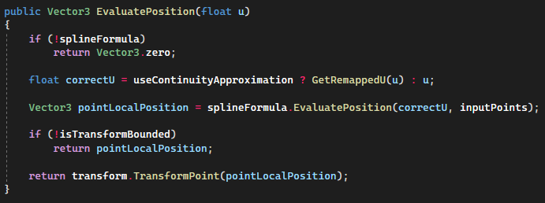

The Spline Controller also allows to store cached information like CumutativeDistances which allows to make the Spline more regular. This works on the principle of remapping the ``u`` value entered in the evaluation functions from pre-computed distances.

Irregular spline|Regular spline
:-:|:-:
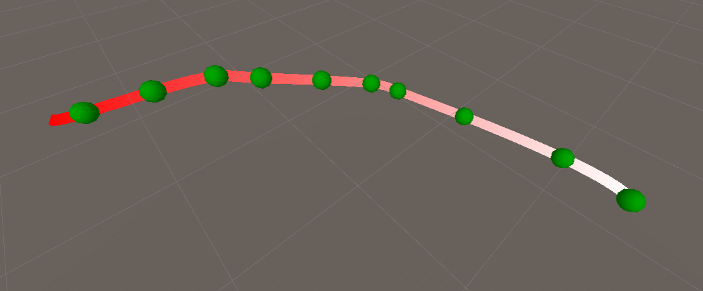|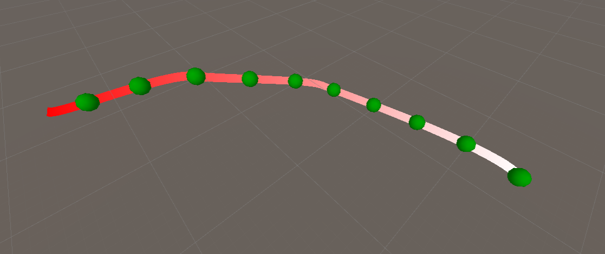

### **Spline Scene Controller**
To facilitate the use of Spline, a SceneController has been implemented. It allows to manage the position of the points from the GUI using Handles. It also allows to insert points when a point is dragged and Ctrl is pressed.

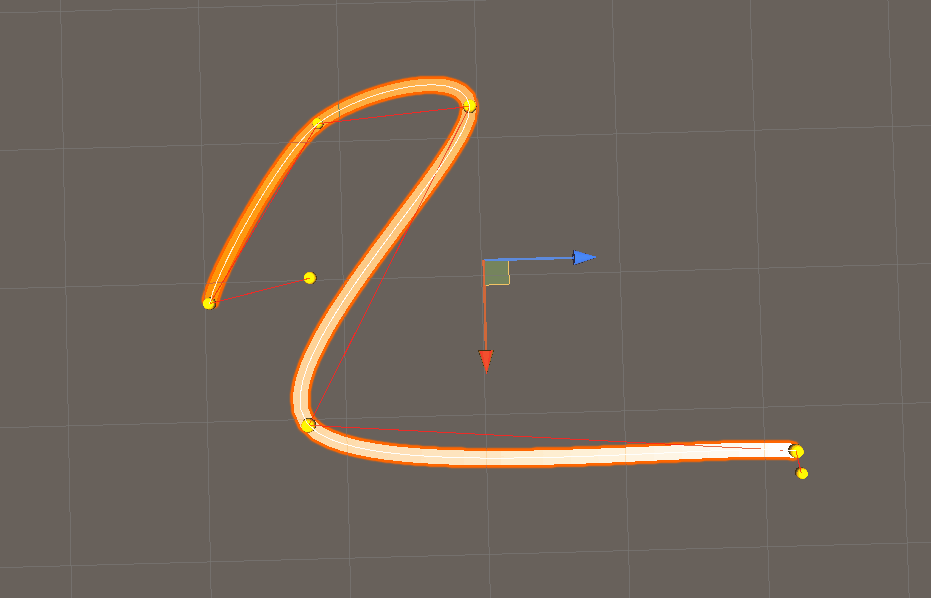

### **Spline Descriptor**

To make the code more open, the formulas managing the shape of the Splines are coded in ScriptableObjects, so that they can be changed at any time in the SplineController. In this demo, the Hermite Spline, the Bezier Spline, the B-Spline and the Catmull-Rom Spline have been implemented. These Splines can work with polynomial and matrix formulas. They allow to evaluate their positions as well as their tangents.

Hermite|Bezier|B-Spline|Catmull-Rom
:-:|:-:|:-:|:-:
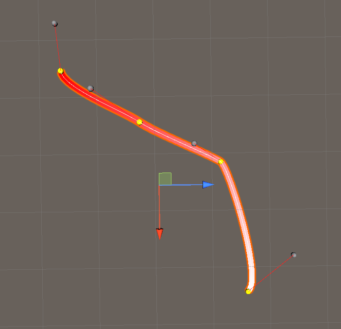|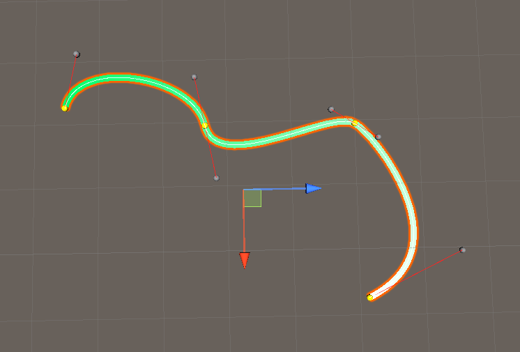|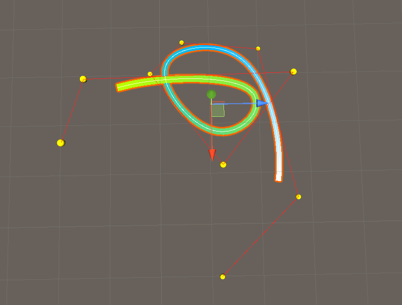|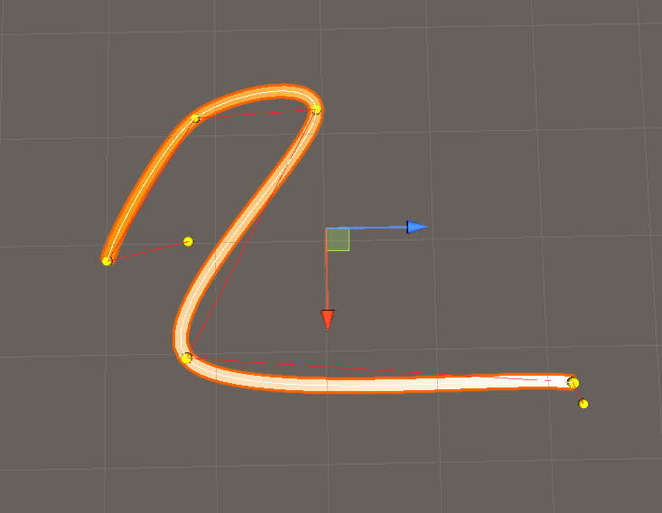

In each ScriptableObject information governing the shape of the Spline or how it is evaluated can be modified. 

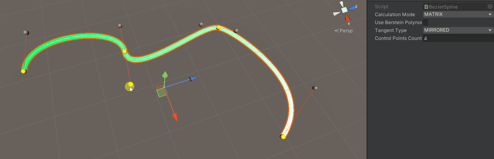
*Different control modes on the Bezier Spline*

For each Spline the polynomials of the tangents were calculated by hand, the matrices were then filled from these formulas.

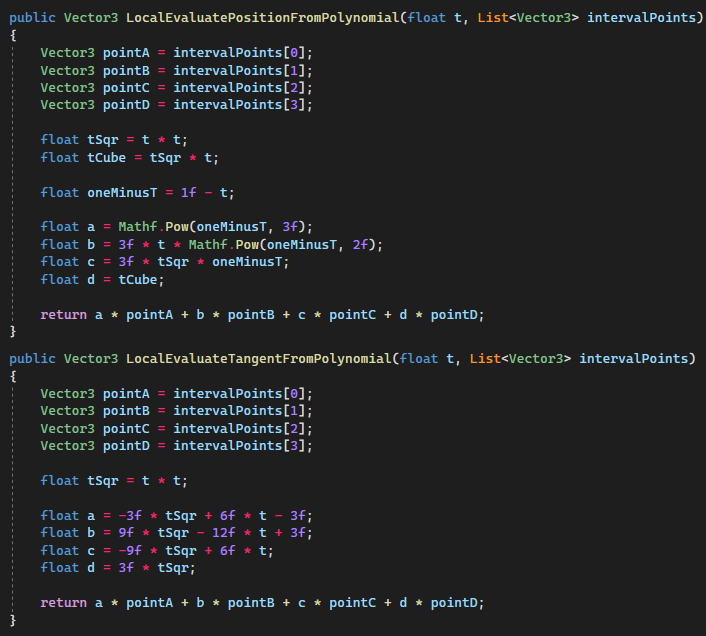

## Gameplay Implementation

### **Pillars generation**

For the gameplay I decided to make a procedural generator of roller coaster tracks. The algorithm consists in making Raycasts every x time and placing a pillar at the contact point.

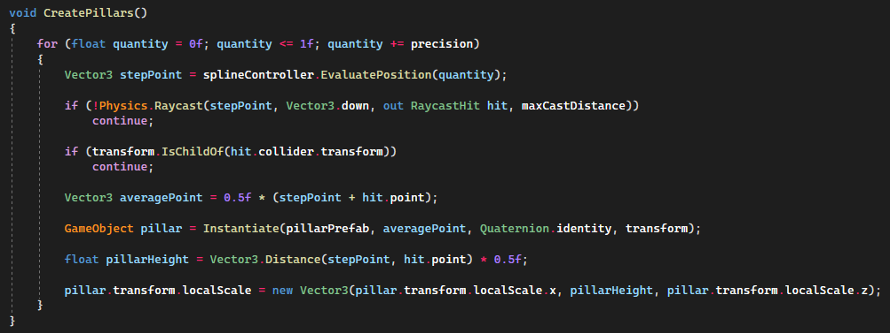

The rail is made of a LineRenderer that follows the Spline.

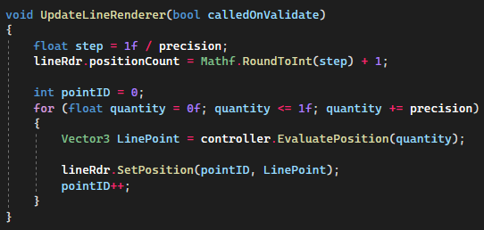

### **Kart motion**

The kart also follows the Spline through the FixedUpdate, in order to have the right direction it evaluates the tangent of the Spline and uses it as a ForwardVector.

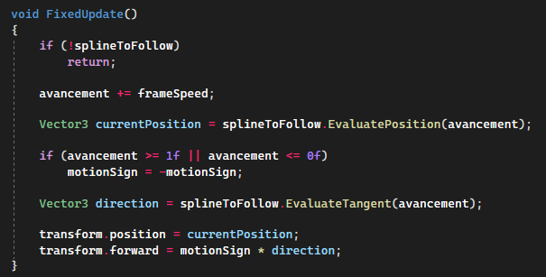

## In the future:
In the future, all this code will surely be ported to C++ on an house-made engine. The calculations to obtain the acceleration, the jerk/jolt at a time t, the patch will surely be implemented as well.

## References:
General references:
- https://en.wikipedia.org/wiki/Spline_(mathematics)
- https://www.youtube.com/watch?v=jvPPXbo87ds

## Versionning
Git Lab for the versioning.

# Author

